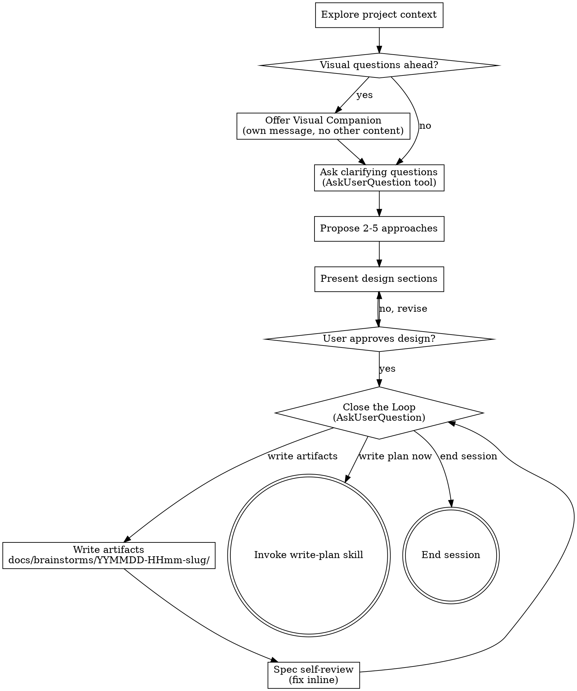

# Brainstorming Ideas Into Designs

Help turn ideas into fully formed designs and specs through natural collaborative dialogue.

Start by understanding the current project context, then ask questions one at a time to refine the idea. Once you understand what you're building, present the design and get user approval.

<HARD-GATE>
Do NOT invoke any implementation skill, write any code, scaffold any project, or take any implementation action until you have presented a design and the user has approved it. This applies to EVERY project regardless of perceived simplicity.
</HARD-GATE>

## Anti-Pattern: "This Is Too Simple To Need A Design"

Every project goes through this process. A todo list, a single-function utility, a config change — all of them. "Simple" projects are where unexamined assumptions cause the most wasted work. The design can be short (a few sentences for truly simple projects), but you MUST present it and get approval.

## Checklist

Complete all applicable steps in order. Steps marked [conditional] are skipped when their condition is false:

1. **Explore project context** — check files, docs, recent commits
2. **[conditional: visual questions expected]** Offer visual companion — this is its own message, not combined with a clarifying question. See the Visual Companion section below.
3. **Ask clarifying questions** — use `AskUserQuestion` tool, one topic at a time, understand purpose/constraints/success criteria
4. **Propose 2-5 approaches** — with trade-offs and your recommendation
5. **Present design** — in sections scaled to their complexity, get user approval after each section
6. **Close the Loop** — use `AskUserQuestion` to present next-action options (write-plan / write artifacts / end session)
7. **[conditional: user chose "write artifacts"]** Write design doc to `docs/brainstorms/YYMMDD-HHmm-<slug>/SUMMARY.md`
8. **[conditional: user chose "write artifacts"]** Spec self-review — quick inline check for placeholders, contradictions, ambiguity, scope; then loop back to Close the Loop
9. **[conditional: user chose "write plan"]** Invoke write-plan skill to create implementation plan

## Process Flow

**Terminal states:** `Invoke write-plan skill` hoặc `End session`. Do NOT invoke frontend-design, mcp-builder, or any other implementation skill — the ONLY implementation skill you invoke is write-plan, and only when the user explicitly chooses it.

## The Process

**Understanding the idea:**

- Check out the current project state first (files, docs, recent commits)
- Before asking detailed questions, assess scope: if the request describes multiple independent subsystems (e.g., "build a platform with chat, file storage, billing, and analytics"), flag this immediately. Don't spend questions refining details of a project that needs to be decomposed first.
- If the project is too large for a single spec, help the user decompose into sub-projects: what are the independent pieces, how do they relate, what order should they be built? Then brainstorm the first sub-project through the normal design flow. Each sub-project gets its own spec → plan → implementation cycle.
- For appropriately-scoped projects, ask questions one at a time to refine the idea
- Prefer multiple choice questions when possible, but open-ended is fine too
- Use `AskUserQuestion` tool for each question — one topic per message
- Focus on understanding: purpose, constraints, success criteria

**Exploring approaches:**

- Propose 2-5 different approaches with trade-offs
- Use `AskUserQuestion` to present options and let the user pick; mark recommended with "(Recommended)"
- Lead with your recommended option and explain why

**Presenting the design:**

- Once you believe you understand what you're building, present the design
- Scale each section to its complexity: a few sentences if straightforward, up to 200-300 words if nuanced
- Ask after each section whether it looks right so far
- Cover: architecture, components, data flow, error handling, testing
- Be ready to go back and clarify if something doesn't make sense

**Design for isolation and clarity:**

- Break the system into smaller units that each have one clear purpose, communicate through well-defined interfaces, and can be understood and tested independently
- For each unit, you should be able to answer: what does it do, how do you use it, and what does it depend on?
- Can someone understand what a unit does without reading its internals? Can you change the internals without breaking consumers? If not, the boundaries need work.
- Smaller, well-bounded units are also easier for you to work with - you reason better about code you can hold in context at once, and your edits are more reliable when files are focused. When a file grows large, that's often a signal that it's doing too much.

**Working in existing codebases:**

- Explore the current structure before proposing changes. Follow existing patterns.
- Where existing code has problems that affect the work (e.g., a file that's grown too large, unclear boundaries, tangled responsibilities), include targeted improvements as part of the design - the way a good developer improves code they're working in.
- Don't propose unrelated refactoring. Stay focused on what serves the current goal.

## After the Design

**Close the Loop:**

After the design is validated, use `AskUserQuestion` to present three next-action options:

1. **"Write plan immediately"** — skip artifacts, handoff directly to write-plan skill using current context
2. **"Write artifacts"** — persist the design to `docs/brainstorms/YYMMDD-HHmm-<slug>/SUMMARY.md`
3. **"End session"** — conversation has produced enough insight; stop here

If the user picks **Write artifacts**, proceed to documentation below, then loop back to Close the Loop.
If the user picks **Write plan immediately**, invoke the write-plan skill — no artifacts needed.
If the user picks **End session**, simply stop.

**Documentation (only when user chooses "Write artifacts"):**

- Directory: `docs/brainstorms/YYMMDD-HHmm-<slug>/`
- Main file (required): `docs/brainstorms/YYMMDD-HHmm-<slug>/SUMMARY.md`
- Optional supporting files: `section-01-<slug>.md`, `section-02-<slug>.md`, etc.
- `SUMMARY.md` should contain: Problem framing, Goals & non-goals, Constraints & assumptions, Approaches considered (with pros/cons), Recommended approach with rationale, Open questions, and Next steps.
- Use elements-of-style:writing-clearly-and-concisely skill if available

**Spec Self-Review (after writing artifacts):**
After writing the spec document, look at it with fresh eyes:

1. **Placeholder scan:** Any "TBD", "TODO", incomplete sections, or vague requirements? Fix them.
2. **Internal consistency:** Do any sections contradict each other? Does the architecture match the feature descriptions?
3. **Scope check:** Is this focused enough for a single implementation plan, or does it need decomposition?
4. **Ambiguity check:** Could any requirement be interpreted two different ways? If so, pick one and make it explicit.

Fix any issues inline, then loop back to Close the Loop to let the user decide the next action.

**Implementation (only when user chooses "Write plan immediately"):**

- Invoke the write-plan skill to create a detailed implementation plan
- Do NOT invoke any other skill. write-plan is the only option here.

## Key Principles

- **One question at a time** - Don't overwhelm with multiple questions
- **Multiple choice preferred** - Easier to answer than open-ended when possible
- **YAGNI ruthlessly** - Remove unnecessary features from all designs
- **Explore alternatives** - Always propose 2-5 approaches before settling
- **Incremental validation** - Present design, get approval before moving on
- **Be flexible** - Go back and clarify when something doesn't make sense

## Visual Companion

A browser-based companion for showing mockups, diagrams, and visual options during brainstorming. Available as a tool — not a mode. Accepting the companion means it's available for questions that benefit from visual treatment; it does NOT mean every question goes through the browser.

**Offering the companion:** When you anticipate that upcoming questions will involve visual content (mockups, layouts, diagrams), offer it once for consent:
> "Some of what we're working on might be easier to explain if I can show it to you in a web browser. I can put together mockups, diagrams, comparisons, and other visuals as we go. This feature is still new and can be token-intensive. Want to try it? (Requires opening a local URL)"

**This offer MUST be its own message.** Do not combine it with clarifying questions, context summaries, or any other content. The message should contain ONLY the offer above and nothing else. Wait for the user's response before continuing. If they decline, proceed with text-only brainstorming.

**Per-question decision:** Even after the user accepts, decide FOR EACH QUESTION whether to use the browser or the terminal. The test: **would the user understand this better by seeing it than reading it?**

- **Use the browser** for content that IS visual — mockups, wireframes, layout comparisons, architecture diagrams, side-by-side visual designs
- **Use the terminal** for content that is text — requirements questions, conceptual choices, tradeoff lists, A/B/C/D text options, scope decisions

A question about a UI topic is not automatically a visual question. "What does personality mean in this context?" is a conceptual question — use the terminal. "Which wizard layout works better?" is a visual question — use the browser.

If they agree to the companion, read the detailed guide before proceeding:
`skills/brainstorming/visual-companion.md`
