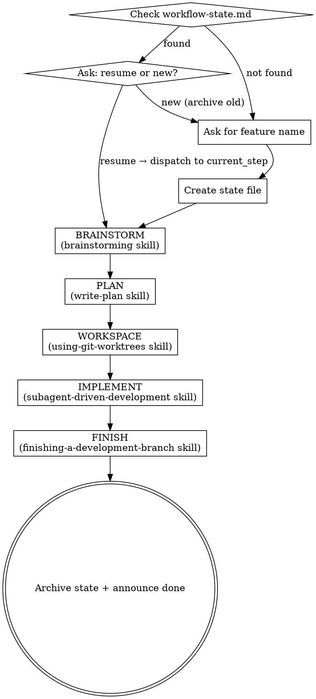

# Full-Flow Feature

Stateful orchestrator that runs the complete feature development lifecycle in one continuous workflow.

**Invoke with:** `/full-flow-feature` or `/full-flow-feature <feature name>`

**When to use:** Starting a new feature from scratch, or resuming an interrupted feature workflow.

---

## Stages

```
1. BRAINSTORM   → brainstorming skill
2. PLAN         → write-plan skill
3. WORKSPACE    → using-git-worktrees skill
4. IMPLEMENT    → subagent-driven-development skill
5. FINISH       → finishing-a-development-branch skill
```

---

## Entry Point

When `/full-flow-feature` is called:

1. Check for existing `docs/plans/workflow-state.md`
2. **Found** → Ask user via `AskUserQuestion`:
   - "Resume `<feature>` (currently at `<current_step>`)?"
   - "Start a new feature (archive the current state)?"
3. **Not found** → Ask for the feature name, create state file, begin at BRAINSTORM

---

## State File

**Location:** `docs/plans/workflow-state.md`

**Format:**

```markdown
---
feature: "<feature name>"
created: "YYYY-MM-DD"
current_step: BRAINSTORM
---

## Steps

| Step       | Status      | Output                                              |
|------------|-------------|-----------------------------------------------------|
| BRAINSTORM | pending     |                                                     |
| PLAN       | pending     |                                                     |
| WORKSPACE  | pending     |                                                     |
| IMPLEMENT  | pending     |                                                     |
| FINISH     | pending     |                                                     |
```

**Update rules:**
- Update state file immediately after each stage completes — never batch updates
- `current_step` always reflects the next pending step
- Each stage records its key output (file path, branch name) in the Output column
- When all steps are `done`, archive state to `docs/plans/workflow-state.archive.md` and announce completion

**Status values:** `pending` → `in_progress` → `done`

---

## Stage Details

### Stage 1: BRAINSTORM

**Entry:** Set BRAINSTORM → `in_progress`, save state.

**Action:** Invoke the `brainstorming` skill.

The brainstorming skill handles everything: context exploration → clarifying questions → design → spec artifacts → write-plan handoff.

**Completion signal:** Brainstorming ends when the user chooses "write plan now" or after artifacts are written. The brainstorming skill will hand off to write-plan — that handoff IS the completion of BRAINSTORM stage.

**State update:** Set BRAINSTORM → `done`, record spec path in Output (e.g., `docs/brainstorms/YYMMDD-HHmm-<slug>/SUMMARY.md`). Set PLAN → `in_progress`.

---

### Stage 2: PLAN

**Entry:** Set PLAN → `in_progress`, save state.

**Action:** Invoke the `write-plan` skill, passing the spec path from BRAINSTORM output as context.

If write-plan was already invoked by brainstorming, check if the plan file already exists. If so, skip invocation and proceed directly to completion.

**Completion signal:** Plan folder created at `docs/plans/YYMMDD-HHmm-<slug>/SUMMARY.md` and user has approved it.

**State update:** Set PLAN → `done`, record plan folder path in Output. Set WORKSPACE → `in_progress`.

---

### Stage 3: WORKSPACE

**Entry:** Set WORKSPACE → `in_progress`, save state.

**Action:** Invoke the `using-git-worktrees` skill.

The worktree skill creates an isolated branch for the feature, runs project setup, and verifies a clean test baseline.

**Completion signal:** Isolated workspace confirmed and baseline tests pass.

**State update:** Set WORKSPACE → `done`, record branch name in Output. Set IMPLEMENT → `in_progress`.

---

### Stage 4: IMPLEMENT

**Entry:** Set IMPLEMENT → `in_progress`, save state.

**Action:** Invoke the `subagent-driven-development` skill, providing:
- Plan path from PLAN output
- Branch/workspace from WORKSPACE output

The subagent skill handles everything: reading the plan, dispatching implementer subagents per task, spec compliance review, code quality review, and final review.

**Completion signal:** All tasks complete, final code reviewer approves, execution report created.

**State update:** Set IMPLEMENT → `done`. Set FINISH → `in_progress`.

**If implementation fails or is paused:** Keep IMPLEMENT as `in_progress`. On next `/full-flow-feature` invocation, resume here with the plan and workspace already in place.

---

### Stage 5: FINISH

**Entry:** Set FINISH → `in_progress`, save state.

**Action:** Invoke the `finishing-a-development-branch` skill.

This skill handles: final checks, merge or PR creation, branch cleanup.

**Completion signal:** Feature merged or PR created and ready.

**State update:** Set FINISH → `done`. Archive state file: rename `docs/plans/workflow-state.md` → `docs/plans/workflow-state.archive.md`. Announce workflow complete.

---

## Process Flow



---

## Resume Behavior

When the user calls `/full-flow-feature` and a state file exists, read `current_step` and dispatch directly to that stage's skill. Each stage is idempotent:

| current_step | Action on resume                                                              |
|--------------|-------------------------------------------------------------------------------|
| BRAINSTORM   | Re-invoke brainstorming skill — it will re-explore context and continue       |
| PLAN         | Check if plan already exists; if yes skip to WORKSPACE, if no re-invoke write-plan |
| WORKSPACE    | Check if branch already exists; if yes skip to IMPLEMENT, if no re-invoke worktree skill |
| IMPLEMENT    | Re-invoke subagent-driven-development with existing plan and workspace         |
| FINISH       | Re-invoke finishing-a-development-branch                                      |

---

## Edge Cases

| Scenario                                | Behavior                                                                          |
|-----------------------------------------|-----------------------------------------------------------------------------------|
| State file found, user wants new start  | Rename old state to `workflow-state.archive.md`, then start fresh                |
| Stage sub-skill fails mid-way           | Keep stage as `in_progress`, do not advance state                                 |
| PLAN already created by brainstorming   | Detect existing plan file → skip write-plan invocation → advance to WORKSPACE    |
| IMPLEMENT blocked                       | Stay `in_progress`; on resume, re-invoke subagent-driven-development with context |
| User wants to skip a stage              | Not supported — ask user to complete or abandon workflow                           |

---

## Announce at Each Stage Transition

At the start of each stage, output a short status line so the user knows where they are:

```
[full-flow-feature] Stage 2/5: PLAN — invoking write-plan skill
```

At the end of the entire workflow:

```
[full-flow-feature] Complete. Feature "<name>" merged. State archived at docs/plans/workflow-state.archive.md.
```

---

## Key Principles

- **State before action:** Always write state file before invoking a sub-skill — if the session crashes mid-stage, the state reflects `in_progress` and resumes correctly
- **One stage at a time:** Never skip or compress stages — each sub-skill expects prior context
- **No manual implementation:** This skill only orchestrates; all implementation is delegated to subagent-driven-development
- **Sub-skill authority:** Each invoked skill owns its own process; do not interrupt or override its steps
